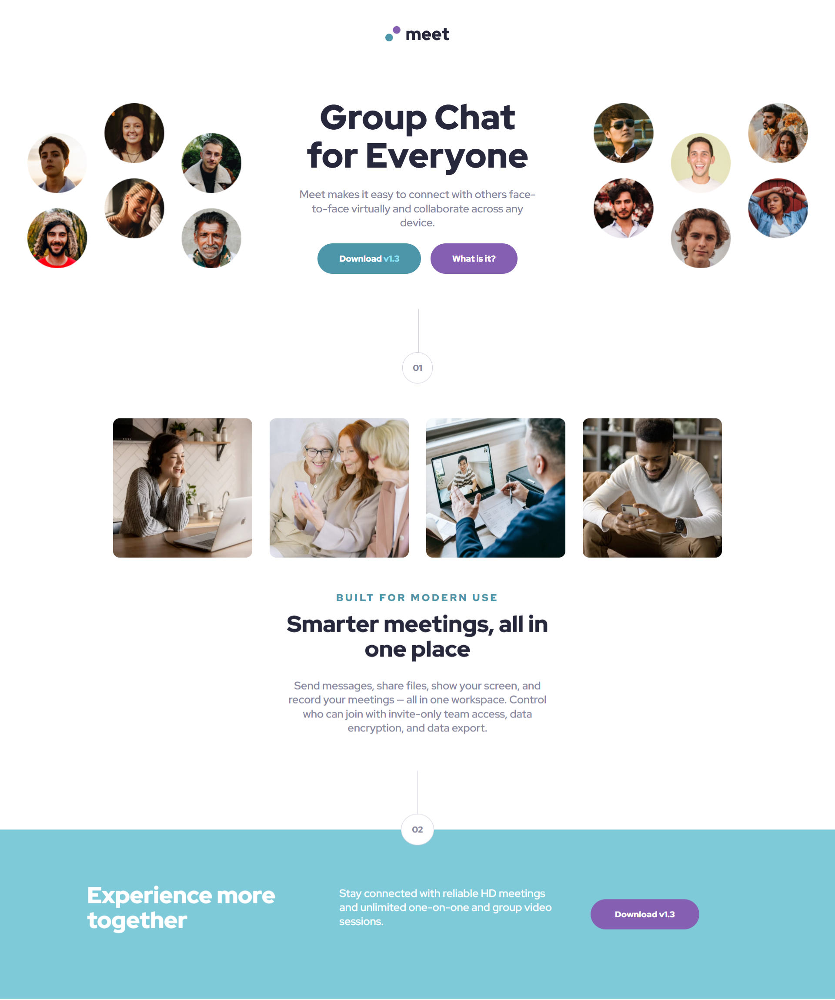

# Frontend Mentor - Solución de página de inicio

Esta es una solución al [desafío de la página de inicio en Frontend Mentor](https://www.frontendmentor.io/challenges/qr-code-component-iux_sIO_H). Los desafíos de Frontend Mentor te ayudan a mejorar tus habilidades de programación creando proyectos realistas.

## Tabla de contenido

- [Descripción general](#descripcion-general)
  - [Captura de pantalla](#captura-de-pantalla)
  - [Llevado a cabo con](#llevado-a-cabo-con)
  - [Autor](#autor)

## Descripción general

### Captura de pantalla

### Links
- [URL de la solución](https://www.frontendmentor.io/solutions/pagina-de-inicio-con-html-y-css--0bwei3Fp-)
- [URL del sitio en vivo](https://braismarquez2025.github.io/meet-landing-page/)

## Mi proceso

### Llevado a cabo con

- Marcado semántico HTML5
- Propiedades personalizadas de CSS
- Preprocesador SCSS
- Flexbox
- Grid

### Autor 
- Usuario de Frontend - [@braismarquez2025](https://www.frontendmentor.io/profile/braismarquez2025)
- Gmail - braismarquez2003@gmail.com

